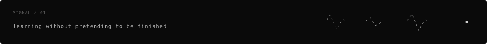

<p align="center">
  
</p>

<p align="center">
  <samp>quiet systems · careful software · real-world constraints</samp>
</p>

<p align="center">
  I like making things that remain understandable when conditions stop being ideal.
</p>

<br />

<table>
<tr>
<td width="33%" align="center">
<sub>mode</sub><br />
<code>learning</code>
</td>
<td width="33%" align="center">
<sub>bias</sub><br />
<code>clarity</code>
</td>
<td width="33%" align="center">
<sub>default</sub><br />
<code>keep it simple</code>
</td>
</tr>
</table>

<br />

### /about

Computer Science student from the Philippines.

I’m drawn to systems, infrastructure, full-stack software, edge computing, and anything that has to keep working outside perfect laboratory conditions.

Not interested in making simple things look complicated.<br />
More interested in understanding why something works, where it fails, and how to make it easier to live with.

<br />



### /principles

```text
clarity      > cleverness
signal       > noise
restraint    > display
evidence     > hype
recovery     > pretending failure won't happen
```

### /working-style

```text
01  understand the constraint
02  remove what does not need to exist
03  make the smallest useful version
04  test the ugly cases
05  leave the system easier to understand
```

### /toolbox

```text
languages      Python · JavaScript / TypeScript · Rust · SQL
backend        Node.js · REST APIs · MySQL · Firebase
systems        Linux · Docker · Git · networking
interests      distributed systems · edge computing · offline-first design
```

<details>
<summary><samp>one more thing</samp></summary>
<br />

I’m still learning. That is probably the most accurate description here.

I’d rather have a repository that shows unfinished thinking clearly than a profile that pretends everything is finished.

</details>

<br />

<p align="center">
  <samp>build quietly / make it hold</samp>
</p>
